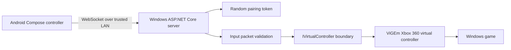

# Architecture

GamePadX has three boundaries: a touch-oriented Android client, a small local WebSocket server, and a replaceable virtual-controller output adapter.

## Current implementation

- `mobile/app` owns the landscape UI, multi-touch state, private-LAN validation, WebSocket lifecycle, ping measurement, and reconnect scheduling.
- `server/GamePadX.Server` owns token generation, private IPv4 binding, WebSocket packet parsing, and XInput-compatible state submission.
- `protocol` documents the wire contract shared by both clients.
- `docs` records setup, security assumptions, and current limitations.

The server currently instantiates the ViGEm adapter directly. Extracting a backend interface is the next server-side refactor before adding other operating systems; Linux/macOS are not supported today.

## Connection flow

1. Start the PC server on a trusted private network.
2. The server creates a cryptographically random 128-bit token and prints it with its private IPv4 address.
3. The Android app validates the address as RFC1918 IPv4 or a `.local` name, then opens an authenticated WebSocket.
4. Input changes are serialized and sent; a one-second ping/pong loop estimates round-trip latency.
5. On an unexpected close, the client retries with bounded exponential backoff. An unauthorized token stops retries.

Pairing is manual in this MVP. QR generation/scanning is not implemented.

## Input flow

Touch handlers update one shared controller state. Button transitions are sent immediately; stick movement is coalesced to roughly one update per 16 ms. The server applies each complete state packet, including releases and neutral stick values, to the virtual controller.
